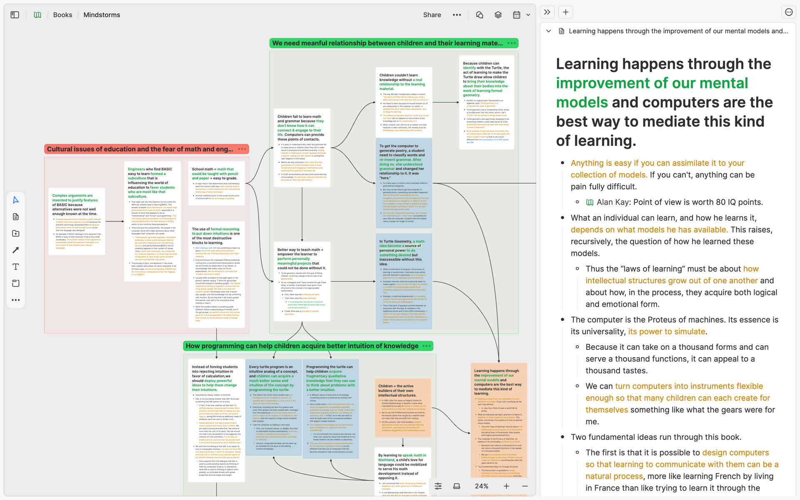
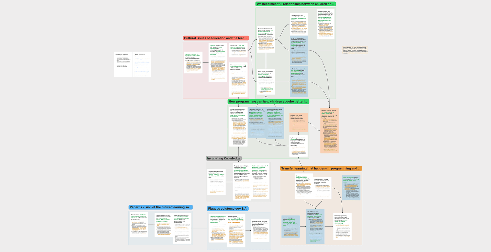
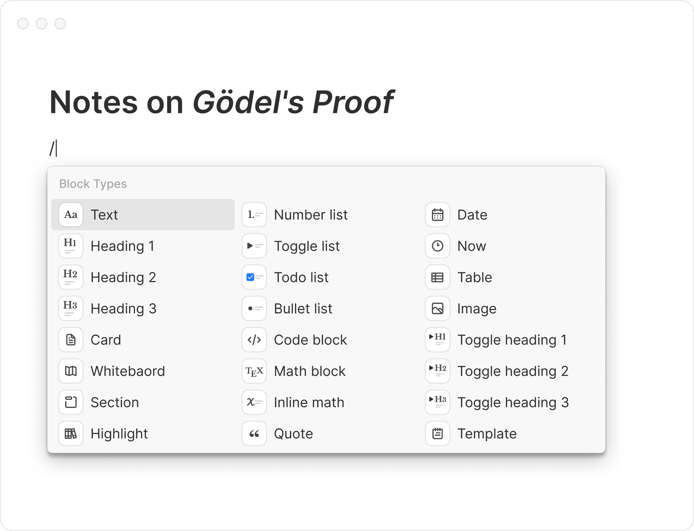
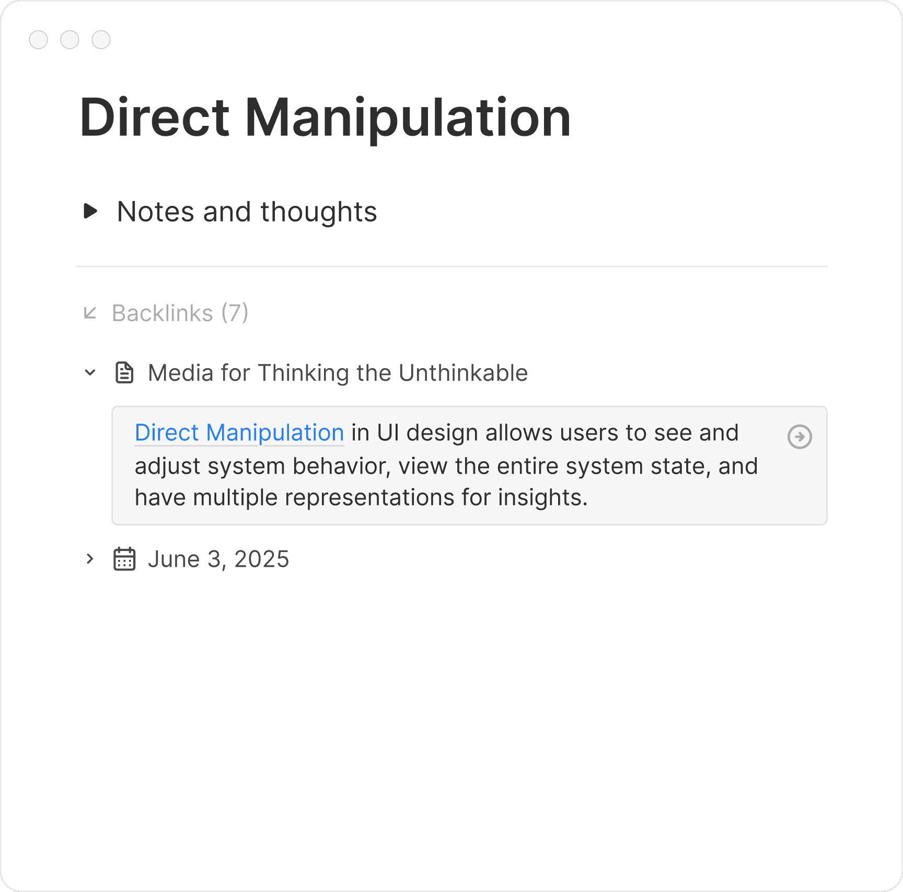
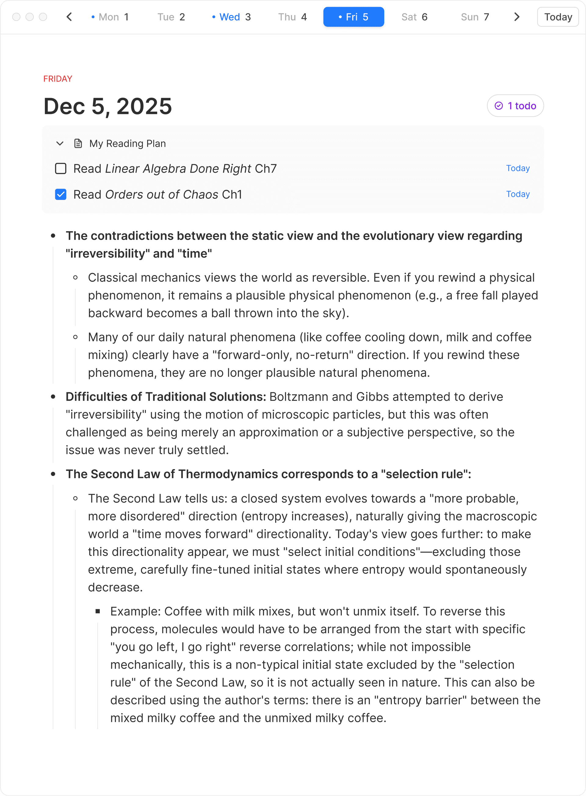
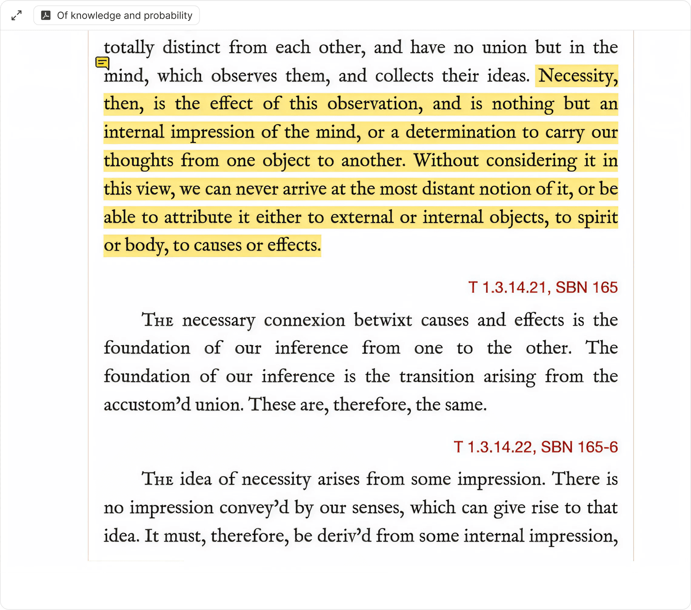
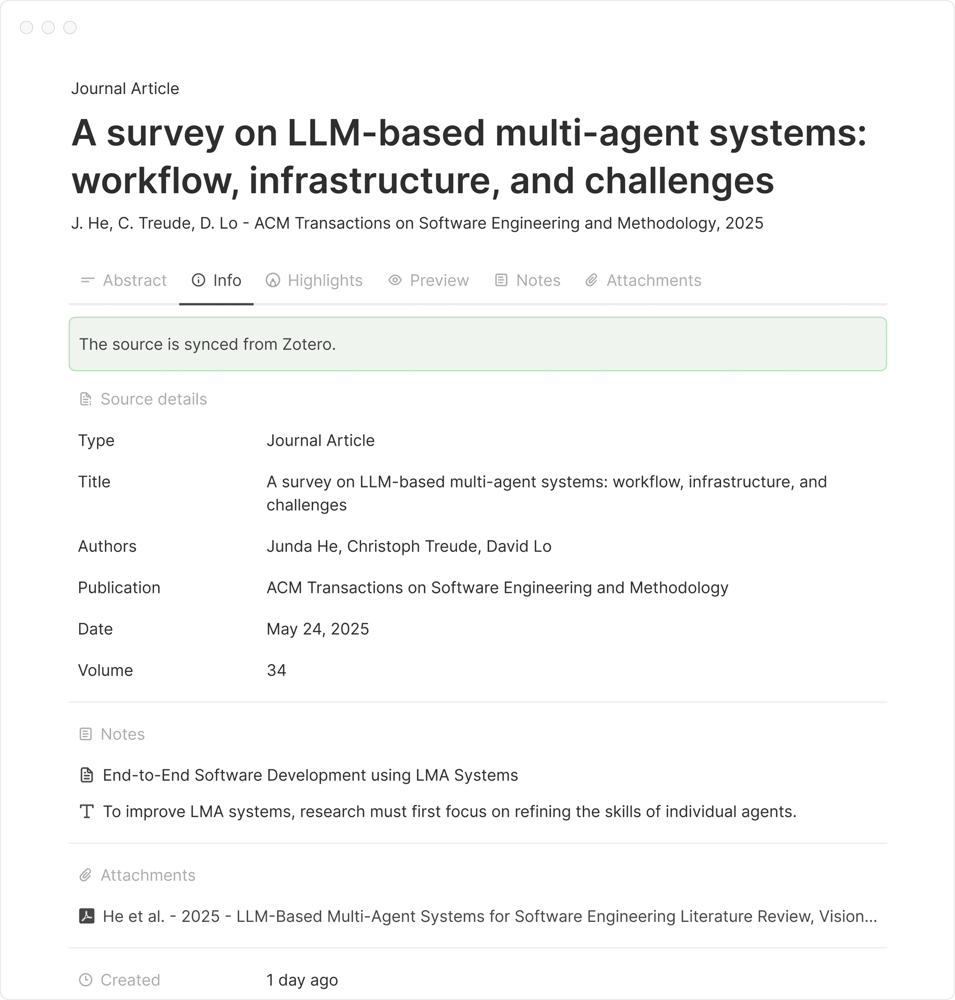
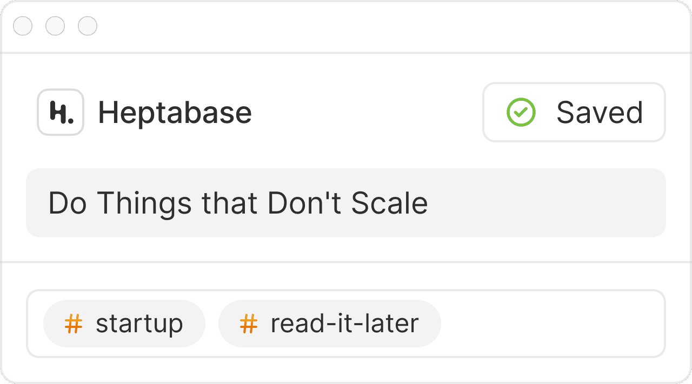

# Heptabase — featureset

Visual knowledge-management app. Notes are atomic **cards**; cards are arranged on infinite
**whiteboards**. Positioned for learning complex topics and research.

Retrieved 2026-09-08. Roadmap last updated 2026-08-28.

Scope: shipped featureset and data model. Not in scope: pricing analysis, reviews, competitor
comparison, company history.

---

## Data model

| Object     | Definition                                                       |
| ---------- | ---------------------------------------------------------------- |
| Card       | Atomic note, rich markdown. The unit everything else references. |
| Whiteboard | Infinite 2D canvas holding cards and other objects.              |
| Section    | Named region inside a whiteboard grouping objects.               |
| Connection | Drawn line between whiteboard objects.                           |
| Tag        | Label carrying user-defined properties. Backs the Tag Database.  |
| Journal    | Daily note stream.                                               |
| Block      | Addressable unit inside a card. Supports block links and embeds. |

Two decisions carry the model:

- **A card can sit on many whiteboards at once** without duplication. The card is the record;
  placement is a reference.
- **Whiteboards nest.** A whiteboard is placeable inside another whiteboard.

Backlinks exist for cards, journals **and whiteboards**.

---

## Whiteboard

| Feature                          | Notes                                        |
| -------------------------------- | -------------------------------------------- |
| Infinite canvas                  | Cards and objects placed freely              |
| Nested whiteboards               |                                              |
| Sections                         | Group objects within a board                 |
| Connections                      | Lines between objects                        |
| Focus mode                       | Displays connected objects                   |
| Mindmap                          | Distinct view; nodes and branches            |
| Turn selection into a whiteboard | Promotes selected objects to their own board |
| Export as image                  |                                              |
| Public share                     | Public gallery of user whiteboards exists    |

In flight: whiteboard performance; shape elements; batch and custom resize.

Visible above, beyond the written feature list: **sections are coloured, named, resizable regions**
that enclose their cards. Connections are curved arrows with arrowheads. Cards render their full
text content inline at 24% zoom rather than collapsing to a title. The focused card opens in a
right-hand pane beside the board. The breadcrumb (`Books / Mindstorms`) shows whiteboard nesting.

---

## Cards and editor

| Feature                                   | Notes                                                                                  |
| ----------------------------------------- | -------------------------------------------------------------------------------------- |
| Rich markdown editor                      |                                                                                        |
| Content types                             | Text, to-do lists, tables, images, audio, video, files, PDFs, code snippets, equations |
| Bidirectional links                       | Backlinks across cards, journals, whiteboards                                          |
| Block links and embeds                    | Block-level addressing, not just card-level                                            |
| Highlight and annotate on a card          |                                                                                        |
| Highlight card                            | Create a card from selected text and place it on a whiteboard                          |
| Create and link a card from selected text |                                                                                        |
| Spell-check                               | Language and dictionary settings                                                       |

---

## Organisation

| Surface      | Purpose                                                                  |
| ------------ | ------------------------------------------------------------------------ |
| Card Library | Left sidebar; every card. Filter by properties and dates.                |
| Tag App      | Left sidebar; every tag.                                                 |
| Tag Database | Each tag is a table — tagged cards are rows, tag properties are columns. |
| Journal      | Daily stream for fleeting capture.                                       |
| Inbox        | Capture triage.                                                          |
| Trash        | Restore deleted cards and whiteboards.                                   |
| Pinned tabs  | Synced across devices.                                                   |

**Tag Database** supports Table and Kanban views, per-view filter settings, calculations, and
column visibility. Bulk select, fill, clear, copy and paste of cell values. Created/Updated time
properties and richer filters (dates, whiteboards, tags, keywords) are in internal testing.

UI metaphor used in their own documentation: left sidebar is browser tabs and bookmarks, right
sidebar is browser plugins.

---

## Search

Global search. Results display location context.

---

## AI and external agents

| Feature                                    | Notes                                                                                                      |
| ------------------------------------------ | ---------------------------------------------------------------------------------------------------------- |
| Heptabase AI, Agent Mode                   |                                                                                                            |
| AI knowledge-base organisation             | Shipped July 2026                                                                                          |
| AI suggested questions                     |                                                                                                            |
| Heptabase CLI                              | 0.6.0. Read content, understand layout, modify objects/sections/connections, export whiteboard screenshots |
| Agent reads block links, embeds, backlinks |                                                                                                            |

Stated direction: making the data accessible to **external** agents. Explicit roadmap item for
tighter integration with Codex and Claude Code. An "AI Agent: LLM Wiki" is in internal testing.

---

## Sync and platforms

Local-first with real-time sync. Works offline, syncs on reconnect.

macOS, Windows, Linux, iOS, Android, web.

Mobile: web capture via Share Sheet, deep links open in-app, media/block sharing, code-block copy,
Trash restore. Mobile performance is in flight.

---

## Collaboration

Granularity is the **whiteboard**, not the workspace.

| Feature                        | Notes                                                           |
| ------------------------------ | --------------------------------------------------------------- |
| Invite by email per whiteboard | Permission levels selectable; "Full access" is one of them      |
| Scoped visibility              | A collaborator sees only the shared whiteboards and their cards |
| Non-subscribers can be invited | They become Free Plan users limited to the shared whiteboard    |
| Whiteboard as topic channel    | Chat per whiteboard; drag a message onto the board to keep it   |
| Emoji reactions                |                                                                 |
| Cards collaborate too          | Not whiteboards only                                            |

Team structure is convention, not a feature: a parent whiteboard with sub-whiteboards per area.

---

## Export and publishing

| Path                            | Granularity                                                                                              |
| ------------------------------- | -------------------------------------------------------------------------------------------------------- |
| Card editor content → Markdown  | Any card, any time                                                                                       |
| Whole knowledge base → Markdown | Full export                                                                                              |
| Data → Markdown, JSON, or PDF   | Full export                                                                                              |
| Whiteboard → image              | Single board                                                                                             |
| Publish                         | Whiteboard only. Re-publish needed after each change. Cannot publish a single card or the whole library. |

Marketed on the strength of this: no lock-in, data stored locally first.

---

## Integrations

| Integration   | Notes                                                                                             |
| ------------- | ------------------------------------------------------------------------------------------------- |
| Readwise      | Polls for new or changed highlights every 15 seconds, syncs automatically                         |
| Zotero        |                                                                                                   |
| PDF and eBook | Import with annotation; highlights from both text selections and areas, placeable on a whiteboard |
| Web cards     | Page capture                                                                                      |

A third-party MCP server exists (community, not first-party), exposing operations such as
whiteboard export.

---

## Pricing

| Plan     | Monthly | Annual (per month) | Notes                                    |
| -------- | ------- | ------------------ | ---------------------------------------- |
| Pro      | $11.99  | $8.99              |                                          |
| Premium  | $23.99  | $17.99             | Unlimited PDF uploads, premium AI models |
| Premium+ | $71.99  | $53.99             | Largest AI credit allowance              |

7-day trial. No free tier available on signup — but an invited collaborator becomes a Free Plan
user scoped to the whiteboard shared with them. The two facts are consistent: free access exists
only by invitation.

---

## Announced, not shipped

Roadmap 2026-08-28 — whiteboard shape elements; Codex/Claude Code agent integration; text plus
background colour together; batch and custom object resize; mindmap nodes as normal whiteboard
objects with connections; mindmap node deletion without branch deletion; Tag Database created and
updated time properties; Tag Database filtering by dates, whiteboards, tags and keywords; Card
Library filtering by properties and dates; Inbox triage improvements; AI Agent LLM Wiki.

---

## Coverage state

Scoped questions are answered. Two areas remain thin, both noted rather than assumed:

| Area                                                              | Status                                                                                                 |
| ----------------------------------------------------------------- | ------------------------------------------------------------------------------------------------------ |
| Data model, whiteboard, cards, editor, organisation, Tag Database | Confirmed                                                                                              |
| Collaboration, export and publishing, integrations                | Confirmed                                                                                              |
| AI, CLI, agent surface                                            | Confirmed                                                                                              |
| Platforms, sync, pricing                                          | Confirmed                                                                                              |
| Search                                                            | Thin — global search and location-context results confirmed; ranking, scope and syntax not established |
| Permission levels                                                 | Thin — "Full access" confirmed as one option; the full set not enumerated                              |

Sources are vendor documentation and vendor-adjacent write-ups. Nothing here is from hands-on use,
so behaviour under load, at scale, or in failure is unverified.

Next entry points: `https://wiki.heptabase.com/changelog/changelog`, the Help Center at
`https://support.heptabase.com/`, and the newsletter index.

---

## References

- Public wiki — `https://wiki.heptabase.com/`
- Roadmap — `https://wiki.heptabase.com/roadmap`
- Changelog — `https://wiki.heptabase.com/changelog/changelog`
- Organize knowledge & projects — `https://wiki.heptabase.com/organize-knowledge-and-projects`
- User interface logic — `https://wiki.heptabase.com/user-interface-logic`
- Tag Database views, filters, calculations — `https://support.heptabase.com/en/articles/16627169-how-do-tag-database-views-filters-calculations-and-column-visibility-work`
- Newsletter 2026-05-29 (Agent Mode, CLI) — `https://wiki.heptabase.com/newsletters/2026-05-29`
- Newsletter 2026-03-24 (note-card highlighting, web cards) — `https://wiki.heptabase.com/newsletters/2026-03-24`
- Newsletter 2026-02-27 (Zotero, AI suggested questions) — `https://wiki.heptabase.com/newsletters/2026-02-27`
- Collaborate and discuss with others — `https://wiki.heptabase.com/collaborate-and-discuss-with-others`
- Collaboration Q&A — `https://support.heptabase.com/en/articles/10510497-collaboration-q-a`
- Readwise Sync Q&A — `https://support.heptabase.com/en/articles/10447319-readwise-sync-q-a`
- Heptabase 1.0 (PDF, Readwise, annotation model) — `https://wiki.heptabase.com/version-one`

### Images

Screenshots in `images/` are the vendor's own product and gallery assets, retrieved 2026-09-08 from
`https://heptabase.com/`. They are kept locally so this document does not rot when the marketing
site changes, and they are reproduced here for reference only.

| File                                | Source asset                                |
| ----------------------------------- | ------------------------------------------- |
| `heptabase-whiteboard.png`          | `whiteboard-feature`                        |
| `heptabase-gallery-whiteboard.png`  | public gallery, "Reading Notes: Mindstorms" |
| `heptabase-editor.png`              | `kb-block-editor`                           |
| `heptabase-bidirectional-links.png` | `kb-bidirectional-links-front-note`         |
| `heptabase-journal.png`             | `kb-daily-journals`                         |
| `heptabase-pdf-annotation.png`      | `kb-pdf-annotation-note`                    |
| `heptabase-readwise.png`            | `kb-readwise-integration`                   |
| `heptabase-zotero.png`              | `kb-zotero-integration-source-card`         |
| `heptabase-web-clipper.png`         | `kb-web-cliper-menu`                        |
